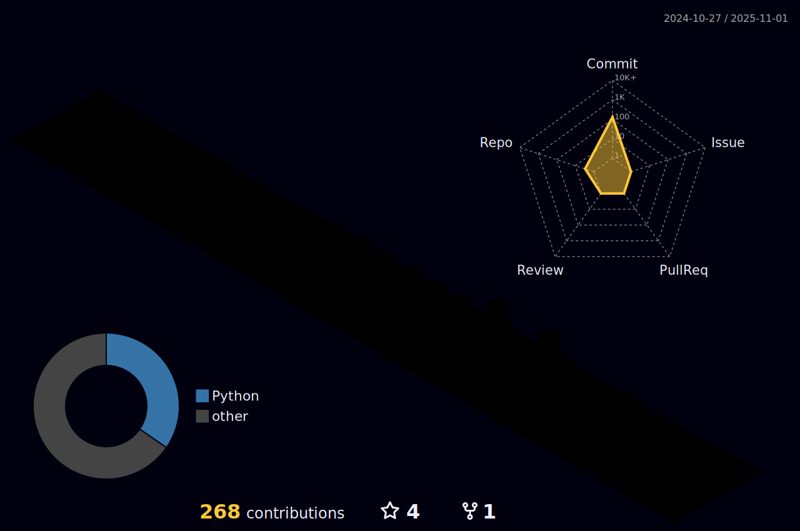

### Hi there I'm Salva 👋

- 🔭 I’m currently working on my phd thesis in Digital Twins
- 🌱 I’m currently learning python and javascript

  <a href="https://github.com/Salva5297">
  
  

  
 
 
  
  
  
  

  

 
 	
  
   
 
  
  

